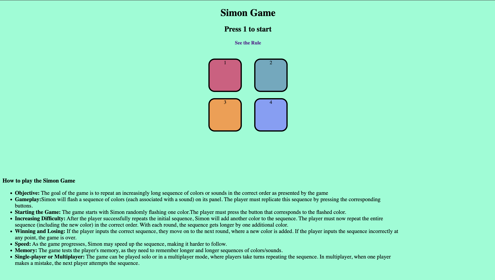

# Simon_Game
**Simon Game**
A web-based Simon Game built using HTML, CSS, and JavaScript. This project replicates the classic memory game, where players are challenged to recall an ever-increasing sequence of lights and sounds.

**Technologies Used**
HTML5: For structuring the game interface.
CSS3: For styling the game elements and ensuring responsive design.
JavaScript (ES6): To implement the game logic and interactivity.

**Project Structure**
Simon_Game/
1. Simon.html        # The main HTML file
2.Simon.css          # The CSS file for styling the game
3.Simon2.js          # The JavaScript file containing the game logic
4.README.md          # This README file

**HomePage:UI**

<!-- https://github.com/Gourav-kumar2131/Simon_Game/blob/main/sounds/UI_Sample.png -->

**Features**
Interactive Gameplay: Displays a sequence of colors with matching sounds that the player needs to repeat.
Responsive Design: Works across different devices, including desktops, tablets, and mobile phones.
Progressive Difficulty: The game becomes more challenging as the sequence gets longer with each round.
Pure Vanilla JavaScript: No external libraries are used, ensuring that the core logic and structure are easily understandable.

**How to Play**
Watch the sequence: The game will flash colors and play sounds in a specific order.
Repeat the sequence: Click the buttons in the same order that the lights and sounds appeared.
Progress through rounds: With each round, the sequence becomes longer and harder to memorize.
Score: The game continues until you make a mistake. Try to beat your high score by remembering the longest sequence!

**Installation**
Clone the repository:
-> git clone https://github.com/Gourav-kumar2131/Simon_Game.git

Navigate to the project directory:
-> cd Simon_Game

**Run the game**: Open the Simon.html file in your browser to start playing.

**Demo**
You can play the game here <!-- If you host the game, replace this with the link -->

**Contributing**
Feel free to fork this project and submit pull requests. Any suggestions or improvements are welcome!